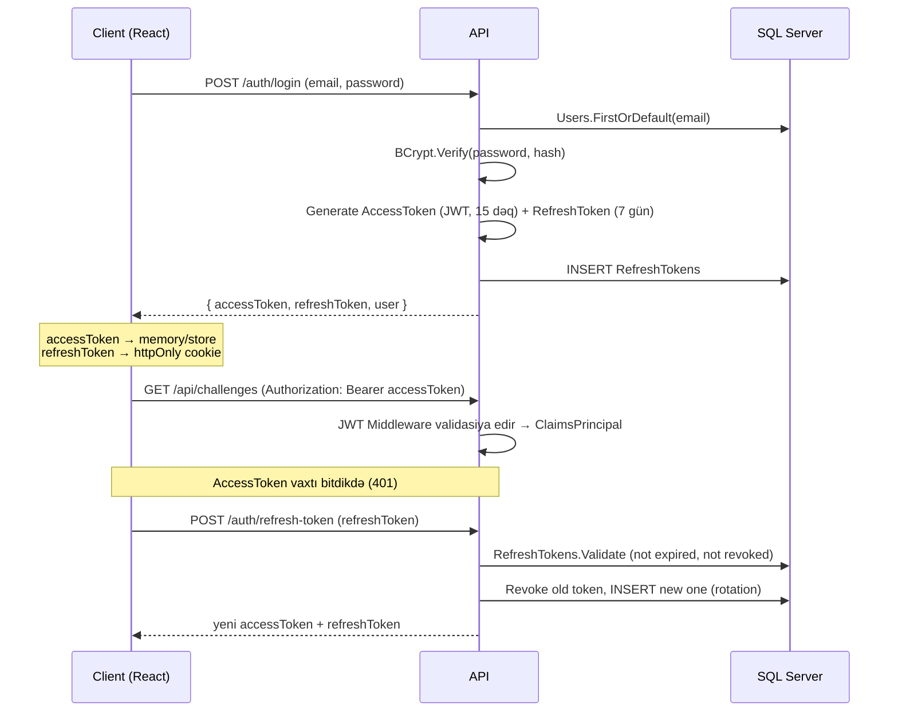

# QuestCraft — Software Architecture Sənədi

> Gamified Coding Platform — C# öyrənən tələbələr üçün
> Versiya: 1.0 · Tarix: 2026-07-09

---

## 0. Texnologiya Stack Xülasəsi

| Qat | Texnologiya | Qeyd |
|---|---|---|
| Backend | ASP.NET Core Web API, **.NET 10 (LTS)**, C# 13/14 | Sistemdə quraşdırılıb (`dotnet --version` → 10.0.204) |
| Arxitektura | Clean Architecture + CQRS (MediatR) | Domain / Application / Infrastructure / API |
| ORM | Entity Framework Core 10, Code-First Migrations | |
| Database | Microsoft SQL Server — **local SSMS instance** (`.\SQLEXPRESS`) | Trusted Connection |
| Auth | JWT (Access Token) + Refresh Token, **BCrypt** (BCrypt.Net-Next) | Role-based: Admin / Student |
| Validation | FluentValidation | Application qatında |
| Logging | Serilog (Console + File sink) | |
| Excel | ClosedXML | Import/Export |
| Kod icrası | İzolə edilmiş subprocess (`dotnet build` + `Process`) | `ICodeExecutionEngine` arxasında modul, gələcəkdə Docker/Judge0 ilə əvəzlənə bilər |
| Frontend | React 19 + **TypeScript** + Vite | |
| Styling | Tailwind CSS | |
| State | Zustand (client state) + TanStack Query (server state/cache) | |
| HTTP | Axios (interceptor ilə avtomatik refresh-token) | |
| Kod redaktoru | Monaco Editor (`@monaco-editor/react`) | |
| Charts | Recharts | Dashboard, XP qrafiki |
| Background Jobs | .NET `IHostedService` (BackgroundService) | Daily Quest generasiyası, Leaderboard snapshot |

Bu sənəd 20 bənddən ibarətdir və kod yazılmazdan əvvəl layihənin tam arxitekturasını təsvir edir.

---

## 1. Sistem Arxitekturası

QuestCraft **Clean Architecture** prinsipi ilə 4 qatdan ibarətdir. Məqsəd: Domain qatının heç bir xarici asılılığı (EF Core, ASP.NET) olmasın, biznes qaydaları test edilə bilsin, kod evaluation kimi modullar asanlıqla dəyişdirilə bilsin.

```
┌─────────────────────────────────────────────────────────────┐
│  QuestCraft.API            (Controllers, Middleware, DI)     │
│  ─ Presentation qatı. HTTP → MediatR Command/Query → HTTP    │
└───────────────────────────┬───────────────────────────────────┘
                             │
┌───────────────────────────▼───────────────────────────────────┐
│  QuestCraft.Application    (CQRS: Commands/Queries, DTO-lar,  │
│                              Validators, Interfaces)           │
│  ─ MediatR handler-lər burada. Repository interfeysləri var,   │
│    implementasiya yoxdur (Dependency Inversion).                │
└───────────────────────────┬───────────────────────────────────┘
                             │
┌───────────────────────────▼───────────────────────────────────┐
│  QuestCraft.Domain          (Entity-lər, Enum-lar, Domain       │
│                               Exceptions, Business Rules)        │
│  ─ Heç bir asılılığı yoxdur. "Saf" C# sinifləri.                 │
└───────────────────────────┬───────────────────────────────────┘
                             │
┌───────────────────────────▼───────────────────────────────────┐
│  QuestCraft.Infrastructure  (EF Core DbContext, Repository      │
│    impl., JWT servisi, BCrypt, Excel, CodeExecution, Logging)   │
│  ─ SQL Server-ə qoşulma burada baş verir.                        │
└───────────────────────────────────────────────────────────────┘
```

**Niyə CQRS + MediatR?** Challenge submission, marketplace purchase kimi əməliyyatlar həm oxuma (query), həm yazma (command) məntiqini aydın ayırır, controller-lər "nazik" qalır, hər bir handler tək məsuliyyət daşıyır (SRP) və transaction/rollback məntiqini `Behavior` (pipeline) səviyyəsində mərkəzləşdirmək mümkün olur.

**React SPA** ayrı layihə kimi backend-dən asılı olmadan build olunur, `VITE_API_URL` vasitəsilə REST API-yə Axios üzərindən qoşulur.

### Sorğu axını (nümunə: Challenge Submit)

```
Browser → POST /api/submissions → SubmissionsController
   → MediatR.Send(SubmitChallengeCommand)
   → ValidationBehavior (FluentValidation)
   → TransactionBehavior (BEGIN TRANSACTION)
   → SubmitChallengeCommandHandler
        → ICodeExecutionEngine.RunAsync(code, testCases)
        → Repository.Add(ChallengeSubmission)
        → GamificationService.AwardXpAndCoins()
        → AchievementEvaluator.Evaluate()
        → DailyQuestService.UpdateProgress()
   → COMMIT (uğurlu) / ROLLBACK (xəta)
   → Response DTO → JSON
```

---

## 2. ER Diagram

Aşağıda əsas 22 cədvəlin əlaqələri (oxunaqlılıq üçün lookup cədvəllər sadələşdirilib) Mermaid formatında verilib:

```mermaid
erDiagram
    ROLES ||--o{ USERS : has
    USERS ||--|| USER_PROFILES : has
    USERS ||--o{ REFRESH_TOKENS : owns
    USERS ||--o{ CHALLENGE_SUBMISSIONS : submits
    USERS ||--o{ USER_ACHIEVEMENTS : unlocks
    USERS ||--o{ USER_DAILY_QUESTS : tracks
    USERS ||--o{ PURCHASES : makes
    USERS ||--o{ QUIZ_ATTEMPTS : attempts
    USERS ||--o{ NOTIFICATIONS : receives
    USERS ||--o{ AUDIT_LOGS : triggers
    USERS ||--o{ ACTIVITY_LOGS : generates
    USERS ||--|| STREAKS : has
    USERS ||--|| USER_STATISTICS : has

    CHALLENGE_CATEGORIES ||--o{ CHALLENGES : groups
    CHALLENGE_DIFFICULTIES ||--o{ CHALLENGES : rates
    CHALLENGES ||--o{ TEST_CASES : has
    CHALLENGES ||--o{ HIDDEN_TEST_CASES : has
    CHALLENGES ||--o{ CHALLENGE_SUBMISSIONS : receives
    CHALLENGE_SUBMISSIONS ||--o{ SUBMISSION_RESULTS : produces

    QUIZZES ||--o{ QUESTIONS : contains
    QUESTIONS ||--o{ QUESTION_OPTIONS : has
    QUIZZES ||--o{ QUIZ_ATTEMPTS : has
    QUIZ_ATTEMPTS ||--o{ QUIZ_ATTEMPT_ANSWERS : records

    ACHIEVEMENTS ||--o{ USER_ACHIEVEMENTS : earned_by
    DAILY_QUEST_TEMPLATES ||--o{ USER_DAILY_QUESTS : instantiates
    MARKETPLACE_ITEMS ||--o{ PURCHASES : sold_as

    USERS {
        int Id PK
        string Username
        string Email
        string PasswordHash
        int RoleId FK
        bool IsActive
        datetime CreatedAt
    }
    USER_PROFILES {
        int UserId PK_FK
        int Xp
        int Coins
        int Level
        string AvatarUrl
        int EquippedFrameId FK
        int EquippedTitleId FK
    }
    CHALLENGES {
        int Id PK
        string Title
        int CategoryId FK
        int DifficultyId FK
        int TimeLimitMs
        int MemoryLimitMb
        int XpReward
        int CoinReward
    }
    CHALLENGE_SUBMISSIONS {
        int Id PK
        int UserId FK
        int ChallengeId FK
        string SourceCode
        string Verdict
        datetime SubmittedAt
    }
```

> Qeyd: Tam 32 cədvəllik siyahı və sütunlar §3-də DDL-yaxın formada verilir.

---

## 3. Database Schema (32 cədvəl)

Konvensiya: hər cədvəldə `Id (int, PK, identity)`, audit üçün `CreatedAt`, `UpdatedAt`, `IsDeleted` (soft-delete) sütunları standart olaraq mövcuddur (aşağıda təkrarlanmır, yalnız domenə xas sütunlar göstərilir).

### 3.1 İstifadəçi & Auth (5 cədvəl)
| Cədvəl | Əsas sütunlar |
|---|---|
| **Roles** | Name (Admin/Student) |
| **Users** | Username, Email (unique), PasswordHash, RoleId FK, IsActive, LastLoginAt |
| **RefreshTokens** | UserId FK, Token, ExpiresAt, IsRevoked, CreatedByIp |
| **UserProfiles** | UserId FK(1-1), Xp, Coins, Level, AvatarUrl, Bio, EquippedFrameId FK→MarketplaceItems, EquippedTitleId FK, EquippedThemeId FK |
| **UserStatistics** | UserId FK(1-1), TotalSubmissions, AcceptedSubmissions, TotalChallengesSolved, TotalQuizzesCompleted, TotalCoinsEarned, TotalCoinsSpent |

### 3.2 Challenge Sistemi (7 cədvəl)
| Cədvəl | Əsas sütunlar |
|---|---|
| **ChallengeCategories** | Name, Description, IconUrl |
| **ChallengeDifficulties** | Name (Easy/Medium/Hard), Color, XpMultiplier |
| **Challenges** | Title, Description, CategoryId FK, DifficultyId FK, TimeLimitMs, MemoryLimitMb, XpReward, CoinReward, StarterCode, Constraints, InputFormat, OutputFormat, SampleInput, SampleOutput, Hint, IsPublished |
| **TestCases** | ChallengeId FK, Input, ExpectedOutput, OrderIndex |
| **HiddenTestCases** | ChallengeId FK, Input, ExpectedOutput, OrderIndex, Weight |
| **ChallengeSubmissions** | UserId FK, ChallengeId FK, SourceCode, Verdict (enum: Accepted/WrongAnswer/TLE/RuntimeError/CompileError), ExecutionTimeMs, MemoryUsedKb, SubmittedAt |
| **SubmissionResults** | SubmissionId FK, TestCaseId, IsHidden, Passed, ActualOutput, ExecutionTimeMs |

### 3.3 Quiz Sistemi (5 cədvəl)
| Cədvəl | Əsas sütunlar |
|---|---|
| **Quizzes** | Title, CategoryId FK, XpReward, IsPublished |
| **Questions** | QuizId FK, Text, Explanation |
| **QuestionOptions** | QuestionId FK, Text, IsCorrect |
| **QuizAttempts** | UserId FK, QuizId FK, Score, TotalQuestions, XpEarned, CompletedAt |
| **QuizAttemptAnswers** | QuizAttemptId FK, QuestionId FK, SelectedOptionId FK, IsCorrect |

### 3.4 Gamifikasiya (8 cədvəl)
| Cədvəl | Əsas sütunlar |
|---|---|
| **Achievements** | Name, Description, IconUrl, ConditionType (enum: SubmissionCount, XpTotal, StreakDays, NoHintSolve, SpeedSolve...), ConditionValue, XpReward, CoinReward |
| **UserAchievements** | UserId FK, AchievementId FK, UnlockedAt |
| **DailyQuestTemplates** | Title, Description, TargetType (enum: SolveChallenge, CompleteQuiz, EarnXp), TargetValue, XpReward, CoinReward, IsActive |
| **UserDailyQuests** | UserId FK, DailyQuestTemplateId FK, QuestDate, CurrentProgress, TargetValue, IsCompleted, RewardClaimed |
| **Streaks** | UserId FK(1-1), CurrentStreak, LongestStreak, LastActivityDate |
| **ActivityLogs** | UserId FK, ActivityDate, ActionCount *(profil təqvimi/heatmap üçün)* |
| **LeaderboardSnapshots** | UserId FK, Period (Daily/Weekly/Monthly/AllTime), Xp, Rank, SnapshotDate |
| **Notifications** | UserId FK, Type, Title, Message, IsRead, CreatedAt |

### 3.5 Marketplace (4 cədvəl)
| Cədvəl | Əsas sütunlar |
|---|---|
| **MarketplaceItemTypes** | Name (Hint/Avatar/ProfileFrame/Theme/Badge/Title) |
| **MarketplaceItems** | Name, Description, ItemTypeId FK, Price(Coin), ImageUrl, IsActive |
| **Purchases** | UserId FK, MarketplaceItemId FK, PricePaid, PurchasedAt |
| **ChallengeHints** | UserId FK, ChallengeId FK, UnlockedAt *(coin ödəyib hint açma)* |

### 3.6 Admin & Sistem (4 cədvəl)
| Cədvəl | Əsas sütunlar |
|---|---|
| **AuditLogs** | UserId FK, Action, EntityName, EntityId, OldValues(json), NewValues(json), Timestamp, IpAddress |
| **SystemSettings** | Key, Value, Description *(XP formulası əmsalları kimi konfiqurasiyalar)* |
| **ExcelImportLogs** | UserId FK(Admin), FileName, EntityType, TotalRows, SuccessRows, FailedRows, ErrorDetails(json), ImportedAt |
| **RateLimitLogs** *(opsional, monitoring üçün)* | IpAddress, Endpoint, RequestCount, WindowStart |

**Cəmi: 5 + 7 + 5 + 8 + 4 + 4 = 33 cədvəl** — tələb olunan 25-35 aralığına uyğundur.

---

## 4. Entity-lər və Əlaqələr (Domain Layer)

Bütün entity-lər `QuestCraft.Domain/Entities` altında, `BaseEntity` (Id, CreatedAt, UpdatedAt, IsDeleted) miras alır.

Əsas əlaqə tipləri:
- **User (1) — (1) UserProfile / UserStatistics / Streak** — auth məlumatı ilə gamification məlumatını ayırmaq üçün (Single Responsibility, auth cədvəli "yüngül" qalır).
- **User (1) — (N) ChallengeSubmission, QuizAttempt, Purchase, Notification, AuditLog** — standart audit/tarixçə əlaqələri.
- **Challenge (1) — (N) TestCase, HiddenTestCase** — composition, Challenge silinərsə cascade.
- **Achievement (N) — (N) User** join cədvəli `UserAchievements` ilə (əlavə sütun: UnlockedAt).
- **MarketplaceItem (1) — (N) Purchase** — hər alış qeydi saxlanılır (audit + statistika üçün), stok konsepti yoxdur (rəqəmsal item).
- **DailyQuestTemplate (1) — (N) UserDailyQuest** — hər gün template-lərdən istifadəçiyə xas instansiya yaradılır.

Domain qatında həmçinin **Domain Events** üçün yer ayrılır (məs. `ChallengeAcceptedEvent`, `LevelUpEvent`) — bunlar Achievement/Notification servislərini "loosely coupled" tetikləmək üçün istifadə oluna bilər (MediatR `INotification`).

---

## 5. Folder Structure

### Backend (Clean Architecture, Monorepo daxilində `/backend`)

```
backend/
├── QuestCraft.sln
├── src/
│   ├── QuestCraft.Domain/
│   │   ├── Entities/
│   │   ├── Enums/
│   │   ├── Events/
│   │   └── Exceptions/
│   ├── QuestCraft.Application/
│   │   ├── Common/
│   │   │   ├── Behaviors/          # ValidationBehavior, TransactionBehavior, LoggingBehavior
│   │   │   └── Interfaces/         # IApplicationDbContext, IUnitOfWork, ICurrentUserService...
│   │   ├── Features/
│   │   │   ├── Auth/               # Commands: Register, Login, RefreshToken
│   │   │   ├── Challenges/         # Commands+Queries+DTOs+Validators
│   │   │   ├── Submissions/
│   │   │   ├── Quizzes/
│   │   │   ├── Gamification/
│   │   │   ├── Marketplace/
│   │   │   ├── Leaderboard/
│   │   │   ├── DailyQuests/
│   │   │   ├── Achievements/
│   │   │   ├── Notifications/
│   │   │   ├── Admin/
│   │   │   └── ExcelIO/
│   │   └── DependencyInjection.cs
│   ├── QuestCraft.Infrastructure/
│   │   ├── Persistence/
│   │   │   ├── ApplicationDbContext.cs
│   │   │   ├── Configurations/     # IEntityTypeConfiguration hər entity üçün
│   │   │   ├── Repositories/
│   │   │   ├── Migrations/
│   │   │   └── UnitOfWork.cs
│   │   ├── Identity/                # JwtTokenService, PasswordHasher (BCrypt)
│   │   ├── CodeExecution/           # ICodeExecutionEngine, SubprocessCodeExecutionEngine
│   │   ├── Excel/                   # ClosedXML servisləri
│   │   ├── BackgroundJobs/          # DailyQuestGeneratorJob, LeaderboardSnapshotJob
│   │   └── DependencyInjection.cs
│   └── QuestCraft.API/
│       ├── Controllers/
│       ├── Middleware/              # ExceptionHandlingMiddleware, RateLimiting
│       ├── Extensions/
│       ├── Program.cs
│       └── appsettings.json
└── tests/
    ├── QuestCraft.UnitTests/
    └── QuestCraft.IntegrationTests/
```

### Frontend (`/frontend`)

```
frontend/
├── src/
│   ├── api/                  # axios instance, interceptors, endpoint funksiyaları
│   ├── app/                  # store (Zustand), router, App.tsx
│   ├── components/
│   │   ├── ui/                # Button, Card, Modal, ProgressBar, XpBar...
│   │   └── layout/             # Navbar, Sidebar, AdminLayout
│   ├── features/
│   │   ├── auth/
│   │   ├── challenges/
│   │   ├── editor/             # Monaco wrapper komponenti
│   │   ├── quiz/
│   │   ├── marketplace/
│   │   ├── leaderboard/
│   │   ├── profile/
│   │   ├── dashboard/
│   │   ├── notifications/
│   │   └── admin/
│   ├── hooks/
│   ├── types/                 # backend DTO-lara uyğun TS interfeysləri
│   ├── utils/
│   └── main.tsx
├── index.html
├── tailwind.config.ts
└── vite.config.ts
```

---

## 6. API Endpoints (əsas modullar)

```
AUTH
  POST   /api/auth/register
  POST   /api/auth/login
  POST   /api/auth/refresh-token
  POST   /api/auth/logout

USERS / PROFILE
  GET    /api/users/me
  PUT    /api/users/me
  POST   /api/users/me/avatar
  GET    /api/users/me/statistics
  GET    /api/users/me/activity-calendar

CHALLENGES
  GET    /api/challenges?category=&difficulty=&page=
  GET    /api/challenges/{id}
  POST   /api/challenges              [Admin]
  PUT    /api/challenges/{id}         [Admin]
  DELETE /api/challenges/{id}         [Admin]
  POST   /api/challenges/{id}/test-cases        [Admin]

SUBMISSIONS
  POST   /api/submissions/run          # sadəcə sample test ilə "Run"
  POST   /api/submissions/submit       # tam qiymətləndirmə (Submit)
  GET    /api/submissions/{id}
  GET    /api/submissions/my

QUIZ
  GET    /api/quizzes
  GET    /api/quizzes/{id}
  POST   /api/quizzes/{id}/attempt
  POST   /api/quizzes                 [Admin]

GAMIFICATION
  GET    /api/gamification/daily-quests
  POST   /api/gamification/daily-quests/{id}/claim
  GET    /api/gamification/achievements
  GET    /api/gamification/leaderboard?period=weekly

MARKETPLACE
  GET    /api/marketplace/items
  POST   /api/marketplace/items/{id}/purchase
  POST   /api/marketplace/items        [Admin]

NOTIFICATIONS
  GET    /api/notifications
  PUT    /api/notifications/{id}/read

ADMIN
  GET    /api/admin/dashboard/stats
  GET    /api/admin/users
  PUT    /api/admin/users/{id}/status
  GET    /api/admin/audit-logs
  POST   /api/admin/excel/import/{entityType}
  GET    /api/admin/excel/export/{entityType}
```

Hər endpoint standart `ApiResponse<T>` wrapper (Success, Data, Message, Errors) ilə qaytarılır; səhifələnmə üçün `PagedResult<T>` istifadə olunur.

---

## 7. DTO-lar (nümunə struktur)

```csharp
// Request
public record RegisterRequest(string Username, string Email, string Password);
public record SubmitChallengeRequest(int ChallengeId, string SourceCode);
public record PurchaseItemRequest(int MarketplaceItemId);

// Response
public record ChallengeListItemDto(int Id, string Title, string Difficulty,
    string Category, int XpReward, bool IsSolvedByCurrentUser);

public record SubmissionResultDto(int Id, string Verdict, int PassedTestCases,
    int TotalTestCases, int ExecutionTimeMs, int XpEarned, int CoinEarned,
    List<AchievementUnlockedDto> NewAchievements);

public record LeaderboardEntryDto(int Rank, string Username, string AvatarUrl,
    int Xp, int Level);
```

Prinsip: Domain entity-lər **heç vaxt** birbaşa API-dan xaricə çıxmır — hər zaman DTO-ya map olunur (AutoMapper və ya manual mapping extension-lar ilə).

---

## 8. ViewModel-lər (Frontend, TypeScript)

```typescript
// types/challenge.ts
export interface Challenge {
  id: number;
  title: string;
  difficulty: 'Easy' | 'Medium' | 'Hard';
  category: string;
  xpReward: number;
  coinReward: number;
  starterCode: string;
  isSolved: boolean;
}

export interface SubmissionResult {
  verdict: 'Accepted' | 'WrongAnswer' | 'TimeLimitExceeded' | 'RuntimeError' | 'CompileError';
  passedTestCases: number;
  totalTestCases: number;
  xpEarned: number;
  coinEarned: number;
  newAchievements: Achievement[];
}
```

DTO-lar backend-dəki C# record-larla 1:1 uyğunlaşdırılır ki, tip təhlükəsizliyi qorunsun.

---

## 9. Repository Layer

Generic Repository + Unit of Work pattern:

```csharp
public interface IRepository<T> where T : BaseEntity
{
    Task<T?> GetByIdAsync(int id, CancellationToken ct = default);
    Task<IEnumerable<T>> GetAllAsync(CancellationToken ct = default);
    IQueryable<T> Query();                 // spesifik filtrasiya üçün
    Task AddAsync(T entity, CancellationToken ct = default);
    void Update(T entity);
    void Remove(T entity);                 // soft-delete tətbiq edir
}

public interface IUnitOfWork
{
    IRepository<Challenge> Challenges { get; }
    IRepository<ChallengeSubmission> Submissions { get; }
    // ... digər repository-lər

    Task<int> SaveChangesAsync(CancellationToken ct = default);
    Task<IDbContextTransaction> BeginTransactionAsync(CancellationToken ct = default);
}
```

Xüsusi sorğular (məs. "leaderboard top 100") üçün ayrıca **specialized repository** metodları (`ILeaderboardRepository`) yazılır — generic repository hər şeyi əhatə etmir.

---

## 10. Service Layer (Application/Infrastructure servisləri)

| Servis | Məsuliyyət |
|---|---|
| `IJwtTokenService` | Access/Refresh token generasiyası və validasiyası |
| `IPasswordHasher` | BCrypt hash/verify |
| `ICodeExecutionEngine` | Kodu compile+run edir, `ExecutionResult` qaytarır |
| `IGamificationService` | XP/Coin hesablama, Level up yoxlaması |
| `IAchievementEvaluator` | Hər event-dən sonra achievement şərtlərini yoxlayır |
| `IDailyQuestService` | Gündəlik quest yaradılması və progress yeniləmə |
| `ILeaderboardService` | Snapshot hesablama və oxuma |
| `IMarketplaceService` | Satın alma, balans yoxlanışı |
| `INotificationService` | Notification yaratma (real-time üçün gələcəkdə SignalR) |
| `IExcelImportService` / `IExcelExportService` | ClosedXML wrapper-lər |
| `IAuditLogService` | Kritik əməliyyatları qeyd edir |
| `ICurrentUserService` | JWT claim-lərdən UserId/Role oxuyur (HttpContext accessor) |

---

## 11. Business Logic (əsas qaydalar)

- **Submission qəbulu**: yalnız `Verdict == Accepted` olduqda XP/Coin verilir, və yalnız **ilk uğurlu submission**-da tam mükafat, təkrar submission-larda XP verilmir (amma statistika artır) — bu qayda `SystemSettings`-də konfiqurasiya edilə bilər.
- **Level formula**: `RequiredXpForLevel(n) = 100 * n^1.5` (round). İstifadəçinin cəmi XP-si bu funksiyaya görə Level-ə çevrilir, hər submission sonrası yenidən hesablanır.
- **Combo Bonus**: eyni gündə ardıcıl 3+ challenge həll edildikdə növbəti mükafata +10% bonus.
- **Streak**: `LastActivityDate` bugündən 1 gün əvvəldirsə `CurrentStreak++`, bugündürsə dəyişməz, daha köhnədirsə `CurrentStreak = 1`.

---

## 12. Authentication Flow



- Parollar **yalnız BCrypt** (`workFactor: 12`) ilə hash olunur, heç vaxt açıq saxlanılmır.
- `[Authorize(Roles = "Admin")]` attribute-u admin endpoint-lərini qoruyur.
- Refresh token **rotation** tətbiq olunur (hər istifadədən sonra köhnə token ləğv edilir) — oğurlanmış token-in təkrar istifadəsinin qarşısını alır.

---

## 13. Code Evaluation Architecture

**Seçilmiş yanaşma: İzolə edilmiş subprocess** (Docker/Judge0-a keçidə hazır modul dizaynı).

```csharp
public interface ICodeExecutionEngine
{
    Task<ExecutionResult> ExecuteAsync(CodeExecutionRequest request, CancellationToken ct);
}

// Infrastructure/CodeExecution/SubprocessCodeExecutionEngine.cs
// Infrastructure/CodeExecution/DockerCodeExecutionEngine.cs   (gələcək, eyni interfeys)
```

Axın:
1. Hər submission üçün müvəqqəti qovluqda minimal konsol layihəsi yaradılır (`Program.cs` + `Solution.csproj`), istifadəçinin kodu `Solution.cs`-ə yazılır.
2. `dotnet build` — uğursuz olarsa → **CompileError**, stderr saxlanılır.
3. Uğurlu build-dən sonra hər test case üçün ayrıca `Process` başladılır:
   - stdin → test input verilir, stdout → oxunur.
   - `CancellationTokenSource(TimeLimitMs)` → vaxt bitərsə `process.Kill(true)` → **TimeLimitExceeded**.
   - Windows Job Object (`Job Objects API`) ilə proses ağacına yaddaş limiti tətbiq edilir.
   - Exit code ≠ 0 → **RuntimeError**.
   - stdout == expectedOutput (trim + normalize) → **Accepted**, əks halda → **WrongAnswer**.
4. Bütün nəticələr `SubmissionResults` cədvəlinə yazılır, ümumi vердikt hesablanır (bütün hidden testlər keçibsə Accepted).
5. Təhlükəsizlik tədbirləri: şəbəkə çıxışı yoxdur (`Process` env-də proxy bloklanır), fayl sistemi girişi yalnız temp qovluqla məhdudlaşdırılır, hər icra sonrası temp qovluq silinir, ölçü/vaxt limitləri sərtdir.

> **Gələcək genişlənmə**: `ICodeExecutionEngine`-in `DockerCodeExecutionEngine` implementasiyası əlavə olunub DI-da `Program.cs`-də bir sətir dəyişdirməklə (strategy pattern) əvəzlənə bilər — biznes məntiqi (submission, XP, achievement) heç dəyişmir.

---

## 14. Gamification Logic

- **XP mənbələri**: Challenge Accepted, Quiz tamamlama, Daily Quest, Achievement, Streak bonusu.
- **Level up**: hər XP artımından sonra `GamificationService.RecalculateLevel()` çağırılır; Level artarsa `LevelUpEvent` publish olunur → Notification yaradılır.
- **Coin mənbələri**: Challenge/Quiz mükafatı, Daily Quest, Achievement bonusu. Coin yalnız Marketplace-də xərclənir.

---

## 15. Marketplace Logic (Transaction nümunəsi)

```csharp
public async Task<PurchaseResultDto> Handle(PurchaseItemCommand cmd, CancellationToken ct)
{
    await using var transaction = await _unitOfWork.BeginTransactionAsync(ct);
    try
    {
        var profile = await _unitOfWork.UserProfiles.GetByUserIdAsync(cmd.UserId, ct)
            ?? throw new NotFoundException(nameof(UserProfile), cmd.UserId);
        var item = await _unitOfWork.MarketplaceItems.GetByIdAsync(cmd.ItemId, ct)
            ?? throw new NotFoundException(nameof(MarketplaceItem), cmd.ItemId);

        if (profile.Coins < item.Price)
            throw new InsufficientCoinsException();

        profile.Coins -= item.Price;
        await _unitOfWork.Purchases.AddAsync(new Purchase { ... }, ct);
        await _unitOfWork.AuditLogs.AddAsync(new AuditLog { Action = "Purchase", ... }, ct);

        await _unitOfWork.SaveChangesAsync(ct);
        await transaction.CommitAsync(ct);

        return new PurchaseResultDto(true, profile.Coins);
    }
    catch
    {
        await transaction.RollbackAsync(ct);
        throw;   // GlobalExceptionMiddleware müvafiq HTTP status qaytarır
    }
}
```

Bu pattern eyni şəkildə **Submission qəbulu** (XP+Coin+Achievement+DailyQuest — 4 cədvəl birlikdə yenilənir) və **Excel Import** (uğursuz sətirdə bütün batch rollback) əməliyyatlarında tətbiq olunur. `TransactionBehavior` MediatR pipeline-ında bu boilerplate-i mərkəzləşdirə bilər ki, hər handler-də təkrarlanmasın.

---

## 16. Leaderboard Logic

- Real-time hesablama böyük istifadəçi sayında baha olduğu üçün **snapshot** strategiyası seçilib: `LeaderboardSnapshotJob` (BackgroundService, hər saat/gün) `UserProfiles`-i XP-yə görə sıralayır və `LeaderboardSnapshots` cədvəlinə yazır (Period: Daily/Weekly/Monthly/AllTime).
- Oxuma zamanı sadəcə snapshot cədvəlindən `WHERE Period = @p ORDER BY Rank` sorğusu işlədilir — sürətli və miqyaslana bilər.
- Kiçik verilənlər bazasında (tələbə demo) real-time query də istifadə oluna bilər, lakin snapshot yanaşması "professional/scalable" tələbinə cavab verir.

---

## 17. Daily Quest Logic

- `DailyQuestGeneratorJob` (BackgroundService, `CRON: 00:00`) hər gün aktiv `DailyQuestTemplates`-dən 3 ədəd random seçir və bütün aktiv istifadəçilər üçün `UserDailyQuests` sətri yaradır (`QuestDate = Today`).
- Progress yenilənməsi **event-driven**: `ChallengeAcceptedEvent`, `QuizCompletedEvent` kimi domain event-lər `DailyQuestService.UpdateProgress()`-i tetikləyir, `CurrentProgress` artırılır, `TargetValue`-ə çatanda `IsCompleted = true` və Notification göndərilir.
- Mükafat yalnız istifadəçi `POST /claim` çağırdıqda verilir (istifadəçi təcrübəsi üçün "claim" animasiyası).

---

## 18. Achievement Logic

- `IAchievementEvaluator.EvaluateAsync(userId, triggerEvent)` — hər əhəmiyyətli hadisədən sonra (submission accepted, quiz completed, login, streak update) çağırılır.
- Strategy pattern: hər `ConditionType` (`SubmissionCount`, `XpTotal`, `StreakDays`, `NoHintSolve`, `SpeedSolve`) üçün ayrıca `IAchievementRule` implementasiyası var; evaluator bütün rule-ları iterasiya edir, şərt ödənibsə və istifadəçidə yoxdursa `UserAchievements`-ə əlavə edir + Notification + XP/Coin bonus.
- Yeni achievement əlavə etmək üçün yalnız DB-yə sətir əlavə etmək kifayətdir (`ConditionType` mövcud rule-lardan biri olduğu halda) — **tam dinamik** idarəetmə tələbinə cavab verir.

---

## 19. Excel Import/Export Architecture

- `IExcelImportService<TDto>` — ClosedXML ilə fayl oxunur, hər sətir `FluentValidation` ilə yoxlanılır, uğurlu sətirlər batch şəklində DB-yə yazılır (tək transaction, uğursuz sətir varsa **bütün fayl rollback** və ya "partial import + error report" seçimi admin-ə təqdim olunur).
- Nəticə `ExcelImportLogs`-a yazılır (neçə sətir uğurlu/uğursuz, xəta detalları JSON kimi) — audit və admin-ə hesabat üçün.
- Export tərəfi: `IExcelExportService` müvafiq query nəticəsini `ClosedXML.Workbook`-a map edir və `FileStreamResult` kimi qaytarır (Users, Challenge Statistics, Quiz Results, Leaderboard, Marketplace Data).

---

## 20. Deployment Strategiyası

**Hazırkı mərhələ (universitet təqdimatı üçün — local run):**
- Backend: `dotnet run` → Kestrel, `https://localhost:5001`.
- Frontend: `npm run dev` (Vite) → `http://localhost:5173`, `VITE_API_URL` ilə backend-ə qoşulur.
- Database: local SQL Server Express (`.\SQLEXPRESS`), `dotnet ef database update` ilə migration tətbiqi, `DbSeeder` ilə demo data (Roller, Admin user, nümunə challenge-lər).
- Konfiqurasiya: `appsettings.Development.json` (connection string, JWT secret) — məxfi məlumatlar `dotnet user-secrets` ilə saxlanılır, repo-ya commit edilmir.

**Gələcək genişlənmə (qeyd üçün, indi tətbiq olunmur):**
- Backend → Azure App Service / Docker konteyner, Database → Azure SQL, kod icrası → Docker Sandbox və ya Judge0 API-yə keçid, frontend → Azure Static Web Apps / Vercel, CI/CD → GitHub Actions.

---

## Növbəti addım

Bu sənəd təsdiqləndikdən sonra implementasiya **addım-addım** aparılacaq (bir dəfəyə bütün layihə yox):

1. Solution + folder skeleton yaradılması (Domain → Infrastructure → Application → API)
2. Database: entity-lər, EF Core konfiqurasiyaları, ilk migration, SSMS-də yaradılma
3. Auth modulu (Register/Login/JWT/Refresh/BCrypt) uçdan-uca
4. Admin CRUD-lar (Category, Difficulty, Challenge, TestCase)
5. Code Execution Engine + Submission axını
6. Gamification (XP/Level/Coin) + Achievement + Daily Quest
7. Quiz, Marketplace, Leaderboard, Notifications
8. Excel Import/Export, Audit Log
9. React frontend (modul-modul, backend-ə paralel)
10. Test, polish, seed data, təqdimat hazırlığı
